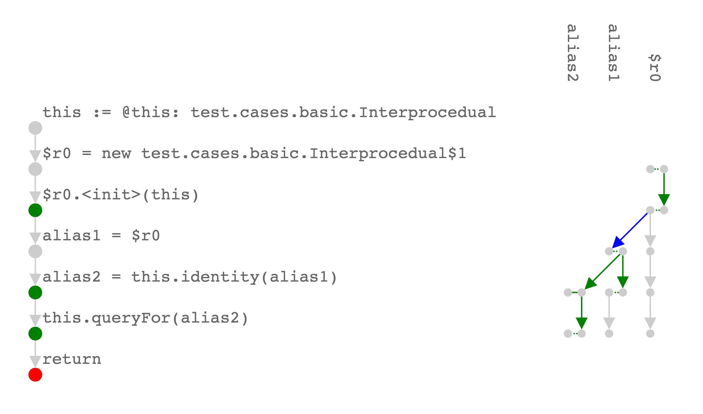

# Boomerang

Boomerang is a demand-driven context and flow-sensitive pointer analysis for Java. It is built on top of [Soot](https://sable.github.io/soot/) and [Heros](https://github.com/Sable/heros).

The key novelties of Boomerang are the *query format* and the *client-driven context-resolution*.

*Query format:* Boomerang delivers rich query information: For a given variable and statement, Boomerang returns the points-to set and additionally **all** pointers visible in the current method that point to the allocation sites in the points-to set. Pointers in Boomerang are abstracted as [access graphs](src/boomerang/accessgraph/AccessGraph.java). Access graphs are used to support field accesses.

*Client-driven context-resolution:* Each query of Boomerang can be limited to a context dictated by the client - the analysis Boomerang is integrated into. Instead of merging points-to information across all possible call sites of a method, Boomerang allows to filter context such that the queries output is with respect to a given calling context. This improves precision when integrating into a context-sensitive analysis, such as a taint or typestate analysis.

# Instructions

This project is an eclipse project and can be imported into your workspace. It depends on the git repositories [Soot](https://github.com/Sable/soot), [Heros](https://github.com/Sable/heros) and [Jasmin](https://github.com/Sable/jasmin). These are included as git submodules to ease the synchronisation process and avoid compile time errors.
To clone a compilable version all submodulues must be available as well. This is taken care of by the use of the --recursive option of git clone.

```
git clone --recursive git@github.com:uasys/boomerang.git
```

After the checkout, the root folder of Boomerang will contain a libs folder with the three submodule repositories. Each of them is an eclipse project. Also import these projects as existing Java projects into your eclipse workspace. Boomerang then has all it dependencies and is ready to be used.

# Examples

We have prepared a couple of examples on how to use Boomerang. They can be found [here](example/example/Example.java).

# Visualization

Boomerang can be dynamically visualized. During and after a query has been resolved, the exploded super-graph that is generated can be visualized as a dynamic webpage. The exploded super-graph can be drawn per method that is visited during a query. To understand the result of the query, the exploded super-graph can then be stepped through interactively per method. The webpage for the visualization can be found [here](visualization/index.html) and can be viewed locally in a browser once this git-project has been checked out.




# Licencse
Boomerang is released under LGPL - see [LICENSE.txt](LICENSE.txt) for details.

# Authors
Boomerang has been developed by [Johannes Späth](mailto:joh.spaeth@gmail.com), Lisa Nguyen Quang Do, [Karim Ali](http://karimali.ca) and [Eric Bodden](http://bodden.de).
